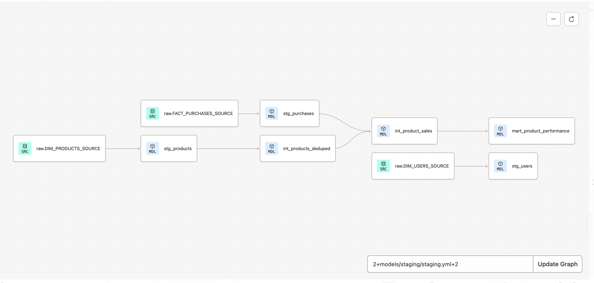

# Product Analytics Engineering with dbt & Snowflake

## Overview

This project demonstrates a modern Analytics Engineering workflow by transforming raw Google Analytics 4 (GA4) ecommerce data into a business-ready **Product Performance Mart** using **Snowflake**, **dbt**, and **SQL**.

Following a layered data modeling approach, the project standardizes raw source data, applies reusable business transformations, and produces a reporting-ready analytics model supported by automated testing, documentation, and version control.

---

## Business Problem

Business stakeholders need an efficient way to answer questions such as:

- Which products generate the most revenue?
- Which products sell the highest quantity?
- How many transactions has each product appeared in?
- When was a product first and last purchased?

Rather than querying raw ecommerce event data, this project creates a reusable analytics model that provides these metrics in a clean, business-friendly format.

---

## Project Objectives

This project was designed to:

- Build an end-to-end analytics engineering workflow
- Implement layered dbt modeling (Staging → Intermediate → Mart)
- Transform raw ecommerce data into reusable business models
- Apply automated testing and documentation
- Create a business-ready Product Performance Mart

---

## Dataset

This project uses the **Google Analytics 4 (GA4) Ecommerce public dataset**.

Due to BigQuery Sandbox export limitations, a representative subset of GA4 event-level data was exported and loaded into Snowflake for modeling. Product, user, and purchase source tables were fully loaded to support the analytics workflow.

---

## Tech Stack

| Technology | Purpose |
|------------|---------|
| **BigQuery** | Source GA4 Ecommerce dataset |
| **Snowflake** | Cloud data warehouse |
| **dbt Fusion** | Data transformation and modeling |
| **SQL** | Data modeling |
| **Git & GitHub** | Version control |

---

## Project Architecture

```
RAW
│
├── DIM_PRODUCTS_SOURCE
├── DIM_USERS_SOURCE
└── FACT_PURCHASES_SOURCE
        │
        ▼
STAGING
├── stg_products
├── stg_users
└── stg_purchases
        │
        ▼
INTERMEDIATE
├── int_products_deduped
└── int_product_sales
        │
        ▼
MART
└── mart_product_performance
```

## Project Lineage



---

## Data Modeling Approach

### Staging Layer

The staging layer standardizes raw source data while preserving its original business meaning.

Models:

- `stg_products`
- `stg_users`
- `stg_purchases`

Responsibilities include:

- Standardizing source data
- Selecting relevant fields
- Renaming columns
- Preparing data for downstream transformations

---

### Intermediate Layer

The intermediate layer contains reusable business logic.

Models:

- `int_products_deduped`
- `int_product_sales`

Key transformations include:

- Deduplicating product records
- Joining purchase transactions with product attributes
- Creating reusable datasets for downstream analytics

---

### Mart Layer

The mart layer contains business-ready models for reporting and analysis.

Model:

- `mart_product_performance`

Key metrics include:

- Total revenue
- Total quantity sold
- Number of transactions
- Average product price
- First purchase date
- Last purchase date

---

## Data Quality

This project implements automated data quality testing using dbt.

### Built-in Tests

- `not_null`
- `unique`
- `relationships`

### Custom Test

- Validates that product revenue values are never negative.

The project successfully passes a full:

```bash
dbt build
```

which builds all models and executes every data quality test.

---

## Documentation

The project includes comprehensive dbt documentation using YAML files for:

- Model descriptions
- Column descriptions
- Data quality tests

Documentation is generated using:

```bash
dbt docs generate
```

---

## Skills Demonstrated

- Analytics Engineering
- dbt Modeling
- Snowflake
- SQL
- Layered Data Modeling
- Data Warehousing
- Source-to-Mart Architecture
- Data Quality Testing
- YAML Documentation
- Git Feature Branch Workflow
- Pull Requests & Code Review

---

## Future Enhancements

Potential future improvements include:

- Customer-level analytics
- Product category performance reporting
- Conversion funnel modeling
- Behavioral event analysis
- Incremental models
- Customer retention metrics

---

## Repository Structure

```
models/
├── staging/
├── intermediate/
└── marts/

tests/
macros/
dbt_project.yml
README.md
```

---

## Lessons Learned

This project strengthened my understanding of modern Analytics Engineering practices, including layered data modeling, reusable transformations, automated testing, YAML documentation, and Git workflows.

Building the project from raw source data through a production-ready mart reinforced the importance of designing maintainable, well-documented data models that can support future business needs.

---

## Author

**Angelique Robinson**

Data Analyst | Analytics Engineering Portfolio

GitHub: https://github.com/angelrob-1
